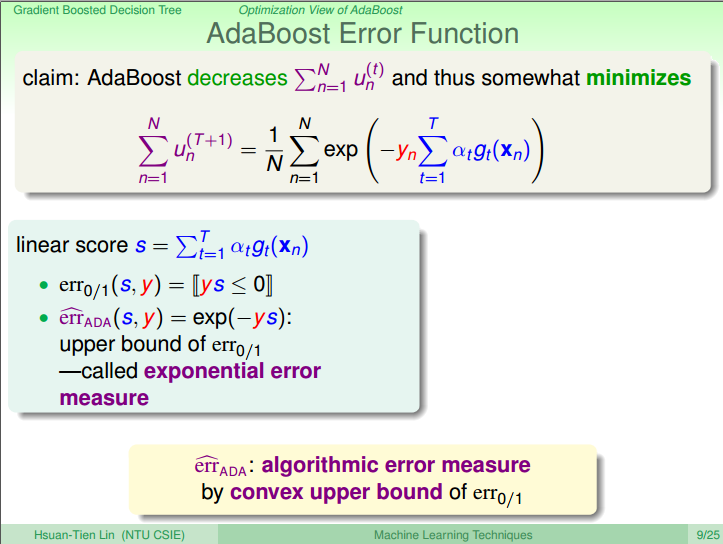

# 1. AdaBoost Decision Tree

## 1.1 从随机森林到AdaBoost Decision Tree

模仿随机的做法，很容易得到AdaBoost Decision Tree的基本流程。

我们需要面临的第一个问题是如何把decision tree改为能接受weight的版本？

## 1.2 weighted decision tree

在decision tree上直接做权重是困难的，那我们可不可以做一点技巧，是其在资料上有权重，能达到weighted decision tree的效果。

具体方法就是在D上按照U来做sampling得到新的资料，然后把该资料输入进decision tree能得到权重的效果。

## weak decision tree algorithm

如果一棵树gt的Ein为0的话，那么就会造成at为无限大的问题。

所以我们需要：

1. pruned tree，利用决策树剪枝让其不要那么强
2. 利用一部分资料来学习，不要那么强

我们已经利用了sampling来达到一部分资料学习的效果，然后再通过剪枝来限制就可以了（简单的可以直接限制树的高度而不用后向剪枝）

# 2. optimization of AdaBoost

这小节我们将从另一个角度看待AdaBoost

## 2.1 Example Weights of AdaBoost

上面将Un+1的更新表达式做了一个简写，然后利用at与◇t的关系，将◇t代换成at。

我们看到，橘色部分出现在了AdaBoost的每个example点的权重里面，我们把这一项叫做voting score。

## 2.2 voting score and margin

老师是这样把Adaboost和margin联系起来的。SVM是线性模型，而Adaboost可以看做一个如上图公式的线性模型。而SVM在距离公式中有一项是yn乘以voting score，而SVM希望它越大越好（真的是这样吗？||W||还没有考虑呢，所以感觉很牵强），咦！正好在Adaboost中也有一项yn乘以voting score，那它也应该越大越好（也很牵强，两者是很像，但是凭什么就可以这样联系？）。

就假设是这样吧！那我们就希望在Ut+1的的表达式中的exp(-yn(voting score))这一项越小越好，也就是希望Ut+1越小越好。

待会儿会告诉大家一个Adaboost的性质就是如果把每一轮的所有的权重加起来的话，这个值会越来越小(sum(ut) > sum(ut+1))

## 2.3 adaboost error function

（建议从这儿看起，因为之前的推导太牵强了）

有了上面的结论之后，我们的error function可以写为如上图的形式。

其实只要记住Adaboost使用的是exponential error measure。

## 2.4 gradient descend on Adaboost error function

模仿gradient descend，比如我已经处于W的哪一个地方了，接下来往哪儿走最好。Adaboost也一样，我已近有了很多at和gt的组合了，接下来的什么样的这个组合最好。

利用泰勒展开得到了一个新的最小化的形式。

## 2.5 Learning Hypothesis as Optimization

最后可以得到的结论是，一个A中好的gt相当于一个gradient descend中的好的h

## 2.6 Deciding Blending Weight as Optimization

我们已经找到了最好的gt，那η呢？不同于gradient descend，我现在想要找到一个最大步，是Error越小越好。正好结果就是Adaboost中的at的结果。

## 2.7 可以这样理解

### 2.7.1 原始的Adaboost error function是这样的

### 2.7.2 那我们在第t次迭代的时候，什么样的h和η才是最好的呢？

### 2.7.3 对于h

我们可以对原式在0点进行泰勒展开：

然后，进行一些小的转换：

最后得出结论是最小Ein的h是最好的。

### 2.7.4 对于η

只需要做一些小的转换即可：

所以对于Adaboost的另一个解释是steepest gradient descend

# 3. Gradient Boosting

## 3.1 Gradient Boosting for Arbitrary Error Function

如果看待exponential error的话，Adaboost每一轮就是在这个上面一步一步做最佳化，每一步找出一个h，把h当成gt，然后决定这个gt上面要走多长的距离，最终变成了gt的票数就是at。

根据这个概念的话，可以进一步延伸到其他类型的学习，我的error不一定要是exponential。如果我在意的是像logistics regression，那我的error就是cross entropy,如果是regression，那就是squared。所以我们可以把它扩展，这个东西叫做gradient boost。

gradient boost讲的是：从某一个已经达到gt和at的组合出发，往h的方向走一小步，想要这件事情变好，想要error function变好。

这就是一个新的aggregation的方式，像Adaboost，只不过比Adaboost更多元化。他可以结合任意的hypothesis。

所以通过gradient boost结合不同的err，就可以实现regression，soft classification等等。（比如Adaboost就是gradient boost使用exponential error function来实现的）

## 3.2 GradientBoost for Regression

对error function在Sn处做泰勒展开，得出h为一个极值

## 3.3 Learning Hypothesis as Optimization

因为我们关心的是h的方向而不是大小，如果限制H的大小的话就变成了一个有条件的最佳化问题。所以可以在Errorfunction中加入一个H的大小的惩罚项。

经过了一些些的推导可以得出，我的新的H就是在（Xn,(yn-sn)）上面做regression。

GradientBoost for Regression的核心就是regression with residuals

##  3.4 Deciding Blending Weight as Optimization

再次回到error function，现在唯一的未知数就是η了，这是一个单变量的线性回归问题，很容易解决的。直接对η求导即可。

## 3.5 Gradient Boosted Decision Tree (GBDT)

如上图所示，如果我们将base algorithm改成regression的C&RT的话，这个算法就是著名的GBDT。

